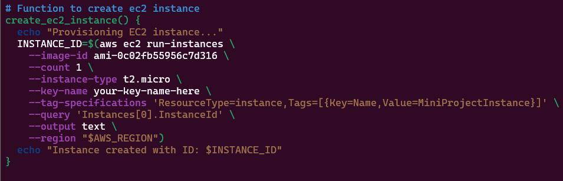
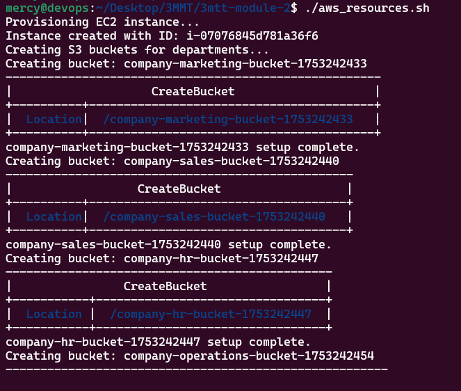

# Mini Project - Creating AWS resources with functions & introducing Arrays

## Project Goal
Write a shell script that:

1. Uses a function to create EC2 instances using the AWS CLI.

2. Uses another function to create 5 S3 buckets using an array (for departments like Marketing, Sales, HR, Operations, Media).

3. Reference AWS Documentation for codes

https://docs.aws.amazon.com/cli/latest/reference/ec2/

## Prerequisites
Before starting, make sure:

1. You have the AWS CLI installed and configured with aws configure.

2. You have permission to create EC2 instances and S3 buckets.

3. You have an AWS key pair already created (or create one via CLI).

VIDEO LINK FOR AWS KEY PAIR CREATION

## Steps to Complete the Mini Project

Step 1: Create Your Shell Script File

Create a new file:

`touch aws_resources.sh`
`chmod +x aws_resources.sh`


Edit it using nano or vim text Editors.ls

`nano aws_resources.sh`

Step 2: Add the Shebang and Setup
At the top of the file:

[Setup](img/image1.png)

Step 3: Function to Create EC2 Instance
This function provisions one EC2 instance:


 
Replace your-key-name-here with your actual EC2 key pair name.

Watch the video below on steps to create a new key pair in AWS


**Note**

$?: is a special variable that holds the exit status of the last executed command. In this case, it checks if the aws ec2 run-instances command was successful. Exit status that equals 0 is interpreted as successful. Therefore, if exit code is “0”, then echo the message to confirm that the previous command was successful.

notice also the use of environment variables to hold the value of ami_id, count, and region and replaced them with their respective values.

Step 4: Function to Create S3 Buckets Using an Array

Arrays in Shell Scripting

An array is a versatile data structure that allows you to store multiple values under a single variable name. Particularly in shell scripting, arrays offer an efficient means of managing collections of related data, making them invaluable for our task ahead.

Below is what the function would look like.

```
# Function to create departmental S3 buckets

create_s3_buckets() {
  echo "Creating S3 buckets for departments..."

  departments=("marketing" "sales" "hr" "operations" "media")

  for dept in "${departments[@]}"; do
    bucket_name="company-${dept}-bucket-$(date +%s)"
    echo "Creating bucket: $bucket_name"

    if [ "$AWS_REGION" == "us-east-1" ]; then
      aws s3api create-bucket \
        --bucket "$bucket_name" \
        --region "$AWS_REGION"
    else
      aws s3api create-bucket \
        --bucket "$bucket_name" \
        --region "$AWS_REGION" \
        --create-bucket-configuration LocationConstraint="$AWS_REGION"
    fi

    aws s3api wait bucket-exists --bucket "$bucket_name"

    aws s3api put-bucket-versioning \
      --bucket "$bucket_name" \
      --versioning-configuration Status=Enabled

    aws s3api put-public-access-block \
      --bucket "$bucket_name" \
       aws s3api put-public-access-block \
      --bucket "$bucket_name" \
      --public-access-block-configuration '{
        "BlockPublicAcls": true,
        "IgnorePublicAcls": true,
        "BlockPublicPolicy": true,
        "RestrictPublicBuckets": true
      }'

    echo "$bucket_name setup complete."
  done
}

```

Step 5: Call the Functions
At the bottom of your script:

# Run the EC2 and S3 creation functions
`create_ec2_instance`
`create_s3_buckets`

Step 6: Final Script Structure (aws_resources.sh)

[Final script structure](https://github.com/mabirhire1/3mtt-module-2/blob/funct-arrays-in-shell-script/aws_resources.sh)

# Save and run the final script with the command below

`./aws_resources`



Step 7: Pictorial outputs


## Summary

In this project, we automated the provisioning of AWS resources—**EC2 instances and S3 buckets**—using **Bash functions and arrays**. A function was created to launch an Amazon Linux EC2 instance using the AWS CLI with `--instance-type`, `--key-name`, and `--security-group-ids` parameters, capturing the instance ID for reference. Another function used an **array of department names** (`marketing`, `sales`, `hr`, `operations`, `media`) to dynamically create S3 buckets for each department. To avoid naming conflicts, we appended a Unix timestamp to each bucket name. We ensured S3 bucket creation succeeded by using the correct `--create-bucket-configuration` based on region (only needed for non-`us-east-1`), enabled versioning, and applied public access restrictions. Throughout the process, we debugged common issues like malformed security group IDs, region mismatches, and unsupported CLI options, while learning how to organize reusable logic with functions and arrays in Bash scripting.


**More Interactions**
show issues resolutions for 
1. malformed security group IDs,
2. region mismatches, and unsupported CLI options
3. Missing explixit environment verification steps for `local`, `testing` and `production`.
