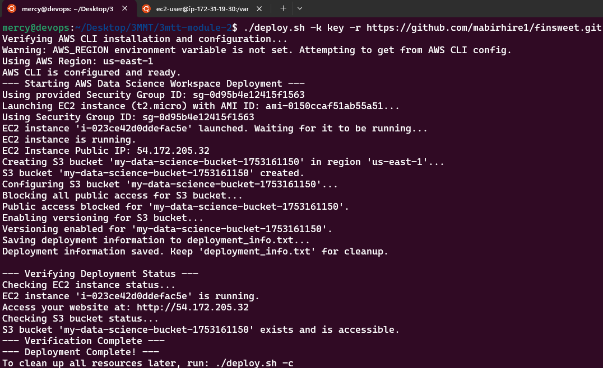
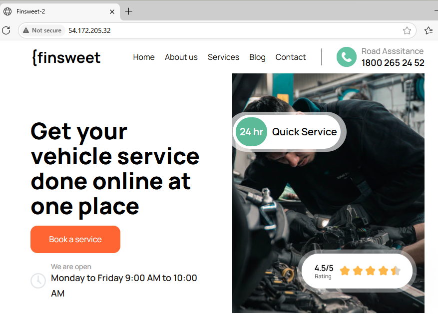
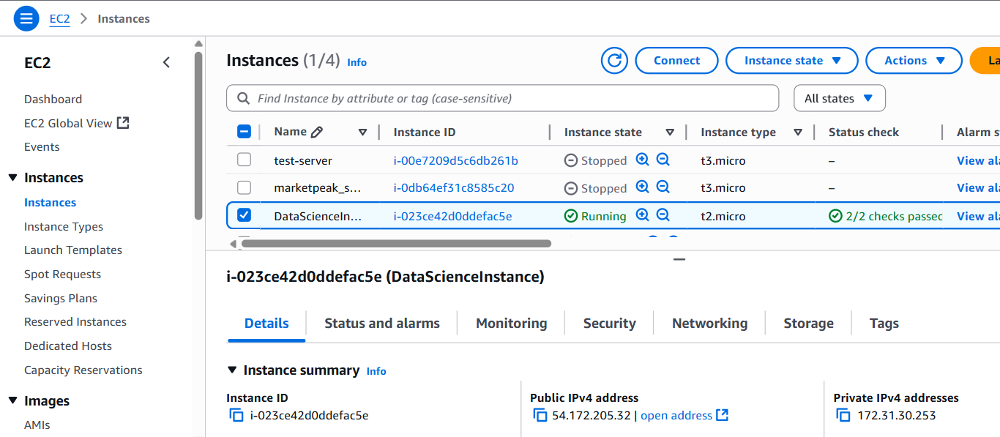
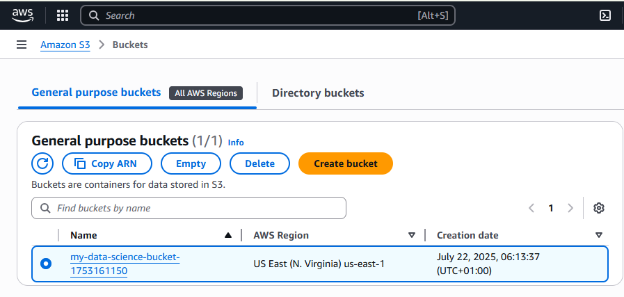
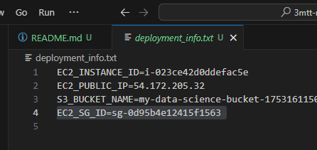
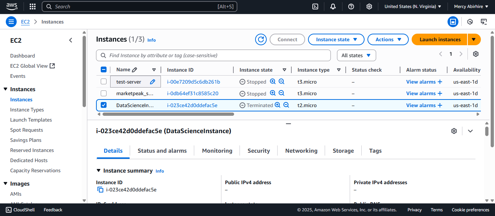
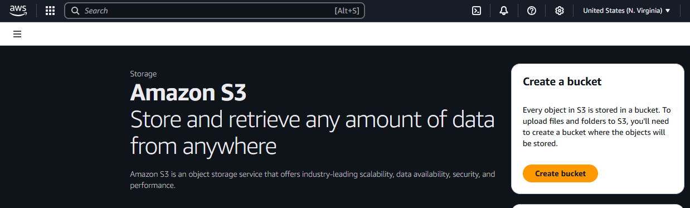

This script incorporates the requested shell scripting concepts:

**. Functions:** For modularity and reusability (e.g., create_ec2_security_group, launch_ec2_instance).

**. Environment Variables:** Relies on AWS_REGION and AWS CLI configured credentials for security.

**. Command Line Arguments:** Allows dynamic input for instance type, bucket name, and key pair.

**. Error Handling:** Uses set -euo pipefail for robust error management and includes specific checks for AWS CLI command success.

## AWS Data Science Workspace Deployment Script
This script will:

1. Verify AWS CLI configuration.

2. Create a Security Group for your EC2 instance.

3. Launch an EC2 instance with Apache HTTPD and Git pre-installed via user data.

4. Create an S3 bucket.

5. Configure the S3 bucket to block public access and enable versioning.

6. Provide basic verification of deployed resources.

7. Offer a cleanup option to remove all created resources.

**`[Deployment Script](deploy.sh)`**

**Steps to Implement and Use the Script:**

**Pre-requisites:**
1. AWS CLI v2 Installed and Configured:

* Ensure you have AWS CLI v2 installed.

* Run aws configure and provide your IAM User's Access Key ID, Secret Access Key, and a default region (e.g., us-east-1). Do NOT use root user credentials.

* Ensure your IAM user has sufficient permissions for EC2 (e.g., ec2:RunInstances, ec2:CreateSecurityGroup, ec2:AuthorizeSecurityGroupIngress, ec2:DeleteSecurityGroup, ec2:TerminateInstances) and S3 (e.g., s3:CreateBucket, s3:PutBucketPublicAccessBlock, s3:PutBucketVersioning, s3:DeleteBucket, s3:DeleteObject). For initial testing, AdministratorAccess can be used, but for production, use least privilege.

**2. EC2 Key Pair:**

You need an existing EC2 Key Pair in the AWS region where you plan to deploy. If you don't have one, create it in the EC2 console under "Key Pairs." Note its name.

**3. Git Repository:**

Have the URL of a Git repository that contains your website files (e.g., an index.html file). The script will clone this and deploy it to the EC2 instance's web server.

## Implementation Steps:
**1. Save the Script:**

* Copy the entire script content provided above.

* Paste it into a new file on your local machine (e.g., in your WSL2 terminal or Linux environment).

* Save the file as deploysh (or any other .sh name).

Bash

`nano deploy.sh # or vim deploy.sh
# Paste script content
# Save and exit`

**2. Make the Script Executable:**

Give the script execute permissions.

Bash

chmod +x deploy.sh

**4. Set AWS Region Environment Variable (Optional but Recommended):**

* While the script attempts to read from aws configure, explicitly setting AWS_REGION ensures clarity. Replace us-east-1 with your desired region.

Bash

export AWS_REGION="us-east-1"

**4. Run the Deployment Script:**

* Now, execute the script, providing the required KEY_PAIR_NAME and optionally customizing other parameters.

* Replace <YOUR_KEY_PAIR_NAME> with the actual name of your EC2 Key Pair.

* You can also specify INSTANCE_TYPE, AMI_ID, S3_BUCKET_NAME, and REPO_URL if you don't want to use the defaults.

Bash

./deploy_workspace.sh -k <YOUR_KEY_PAIR_NAME>

* The script will print its progress, including the created Security Group ID, EC2 Instance ID, and its Public IP address. It will also save this information to a file named deployment_info.txt in the same directory as the script.

**5.  Verify Deployment:**

* After the script completes, it will print the Public IP of your EC2 instance.

* Open a web browser and navigate to http://54.172.205.32/ You should see the website deployed from your Git repository.

* You can also log into your AWS Management Console to verify the EC2 instance and S3 bucket.

**6. Clean Up Resources (IMPORTANT!):**

* To avoid incurring unnecessary AWS charges, remember to clean up the resources created by the script.

* The script automatically saves deployment details to deployment_info.txt. To clean up, simply run the script with the -c flag from the same directory:

Bash

./deploy.sh -c

* The script will read the deployment_info.txt file and attempt to terminate the EC2 instance, delete the S3 bucket (emptying it first), and delete the Security Group.

## Pictures of Process Execution

