Part - 1

Just a quick reminder about the subnets we configured in our VPC in the [Previous project][../AWS VPC mini project.md]. In the public subnet, we've created an EC2 instance that is running, hosting our website. Now, let's take a moment to see if we can access the website using its public IP address.

So this EC2 instance hosts our website.

Here's the security group configuration for the instance. In the inbound rules, only IPv4 SSH traffic on port 22 is permitted to access this instance.

For the outbound rule, you'll notice that all IPv4 traffic with any protocol on any port number is allowed, meaning this instance has unrestricted access to anywhere on the internet.

Now, let's test accessibility to the website using the public IP address assigned to this instance. Here, let's retrieve the public IP address.

If you enter "[http://54-198-159-73](https://www.google.com/search?q=http://54-198-159-73)" into your Chrome browser and hit enter, you'll notice that the page doesn't load; it keeps attempting to connect. And finally it'll show this page. After some time, you'll likely see a page indicating that the site can't be reached.

Security group does not have HTTP protocol defined.

To resolve this issue, we can create a new security group that allows HTTP (port 80) traffic.

1.  Navigate to the "Security Groups" section on the left sidebar.
    a) Then click on "Create Security Group".

2.  Please provide a name and description for the new security group.
    a) Ensure to select your VPC during the creation process.

    b) Click on add rule.

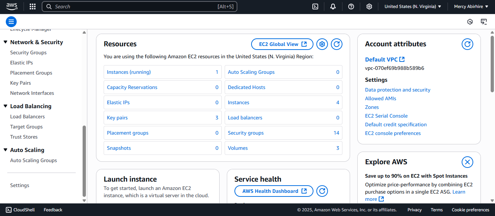

    c) Now, select "HTTP" as the type.

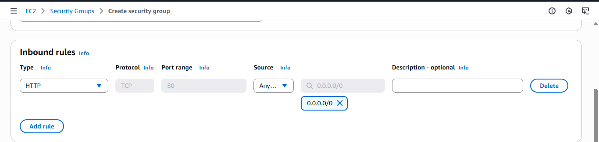

    d) Use 0.0.0.0/0 as the CIDR Block. (Here we are allowing every CIDR block by using this CIDR).

    e) Keep outbound rules as it is.

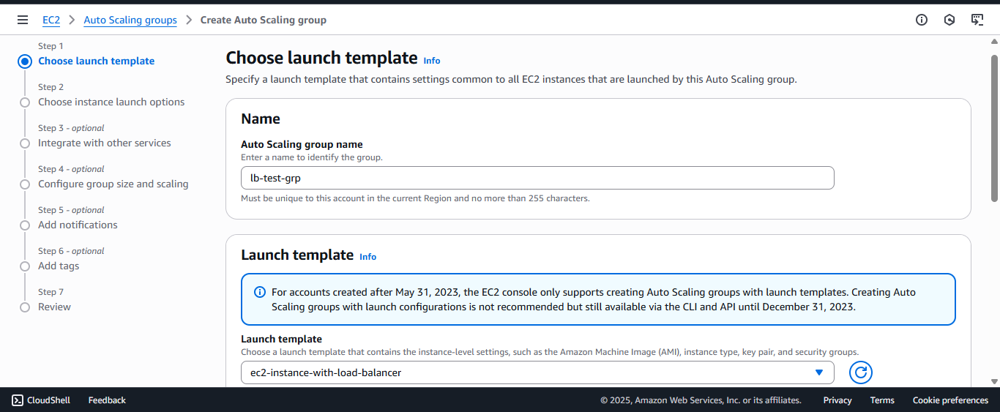

    f) Now, click on Create security group.

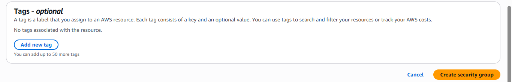

Now, it is being created successfully.

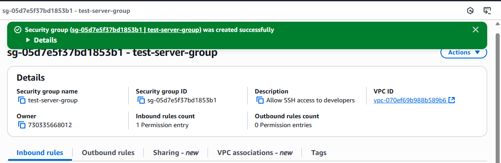

Let's attach this security group to our instance.

3. Now navigate to the instance section of left side bar,
   a) Select the instance.

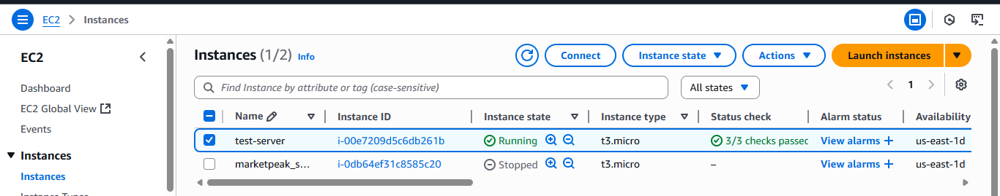

   b) Click on "Actions."

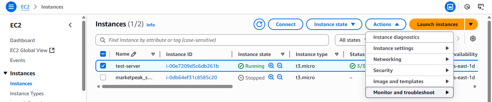

   c) Choose "security."

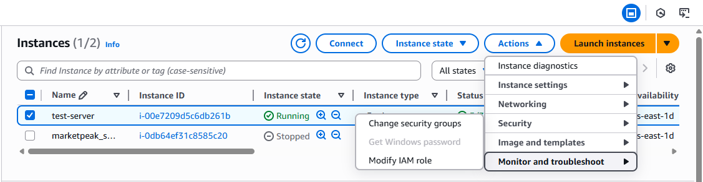

d) Click on "Change security group."

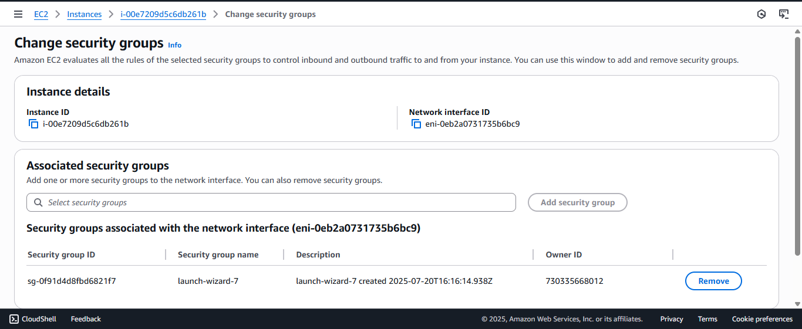

4. Choose the security group you created.

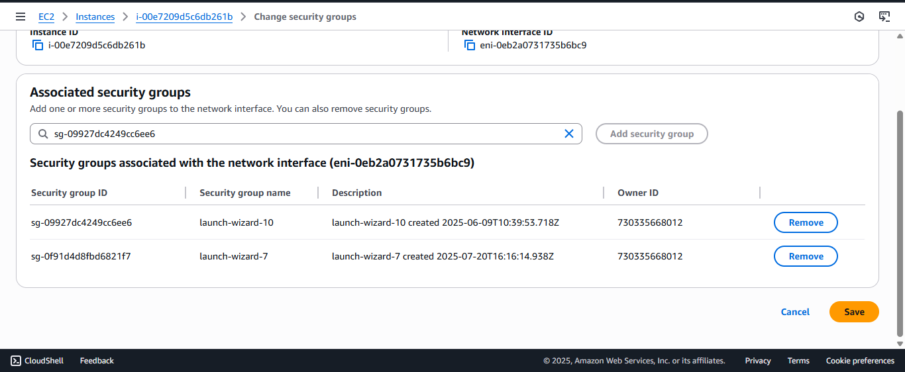

a) Click on "Add security group"

b) You can see security group is being added, Click on "save."

Note - The security group named "Launch Wizard 7" one is the default security group automatically attached when creating the instance.
You can also edit this security group if needed.

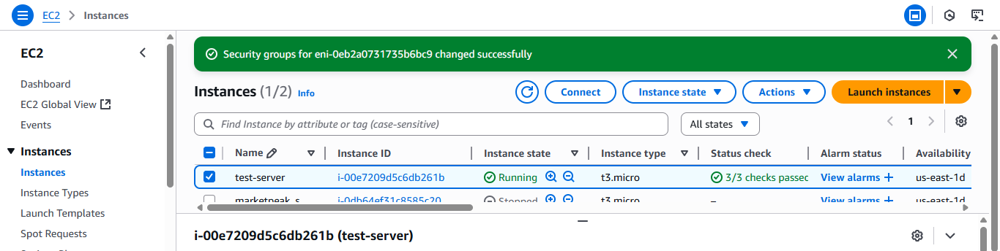

5. Now it is being attached successfully,

a) If you again copy the public IP address,

b) And write http://54-198-159-73 in Chrome, We'll be able to see the data of our website.

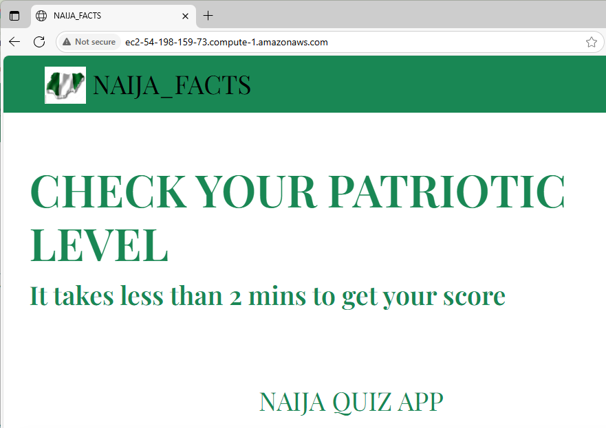

Currently, let's take a look at how our inbound and outbound rules are configured.

This setup allows the HTTP and SSH protocols to access the instance.

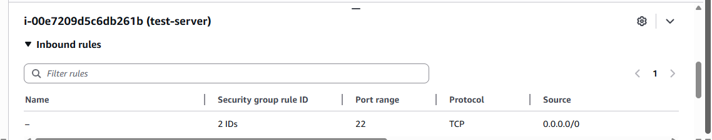

The outbound rule permits all traffic to exit the instance.

Through this rule, we're able to access the website.

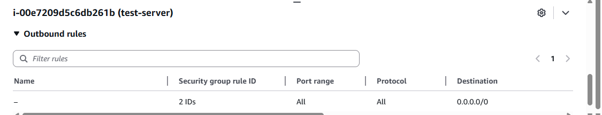

6. let's see how removing the outbound rule affects the instance's connectivity. Means now, no one can go outside to this instance.

    a) Go to outbound tab.
    b) Click on "edit outbound rules".

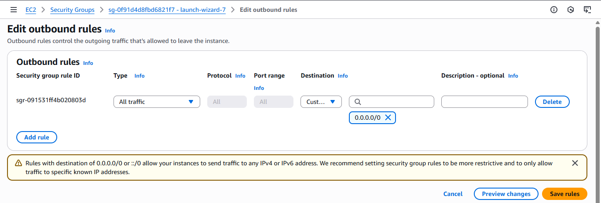

    c) Click on "Delete".
    d) Click on "Save rules".

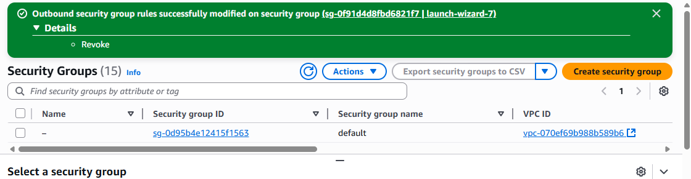

Now that we've removed the outbound rule, let's take a look at how it appears in the configuration.

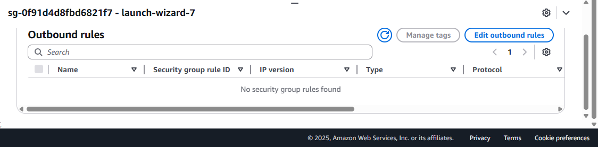

After making this change, let's test whether we can still access the website.

So, even though we've removed the outbound rule that allows all traffic from the instance to the outside world, we can still access the website. According to the logic we discussed, when a user accesses the instance, the inbound rule permits HTTP protocol traffic to enter. However, when the instance sends data to the user's browser to display the website, the outbound rule should prevent it. Yet, we're still able to view the website. Why might that be?

Security groups are stateful, which means they automatically allow return traffic initiated by the instances to which they are attached. So, even though we removed the outbound rule, the security group allows the return traffic necessary for displaying the website, hence we can still access it.

Let's explore the scenario,

If we delete both the inbound and outbound rules, essentially, we're closing all access to and from the instance. This means no traffic can come into the instance, and the instance cannot send any traffic out. So, if we attempt to access the website from a browser or any other client, it will fail because there are no rules permitting traffic to reach the instance. Similarly, the instance won't be able to communicate with any external services or websites because all outbound traffic is also blocked.

7. You will be able to delete the inbound rule in the same way we have deleted the outbound rule.

a) Go to outbound tab.

b) Click on edit inbound rule

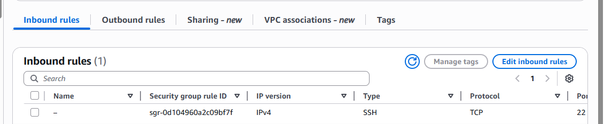

c) Click on delete.

d) Click on "Save rule."

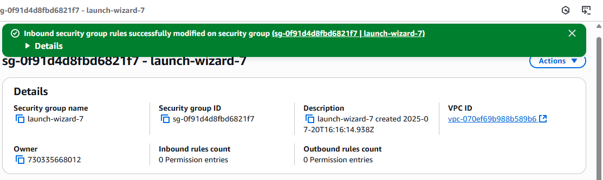

Currently, let's have a look at how our inbound and outbound rules are configured.

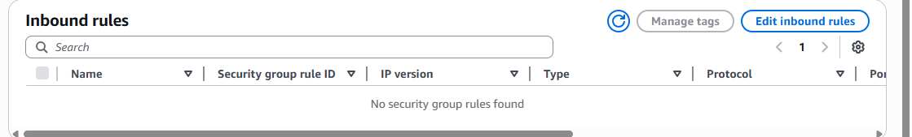

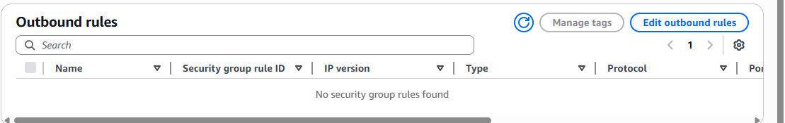

Now, as both the inbound and outbound rules deleted, there's no way for traffic to enter or leave the instance. This means that any attempt to access the website from a browser or any other client will fail because there are no rules permitting traffic to reach the instance. In this state, the instance is essentially isolated from both incoming and outgoing traffic.

So you can't access the website now.

In the next scenario,

We'll add a rule specifically allowing HTTP traffic in the outbound rules. This change will enable the instance to initiate outgoing connections over HTTP.

8. Click on edit outbound rule in the outbound tab.

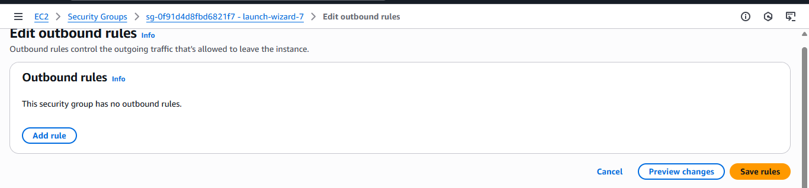

a) Click on "add rule"

b) Choose type

c) Choose destination.

d) Choose CIDR.

a) Click on "save rules"

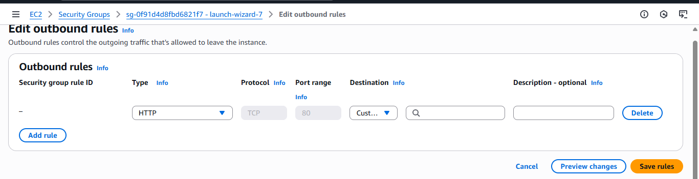

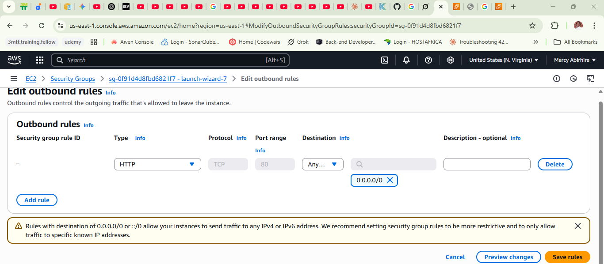

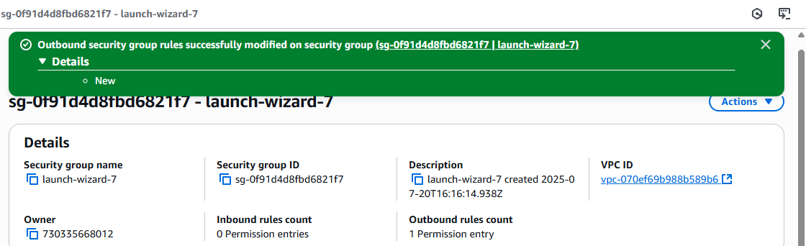

Now, let's see if we can access the website.

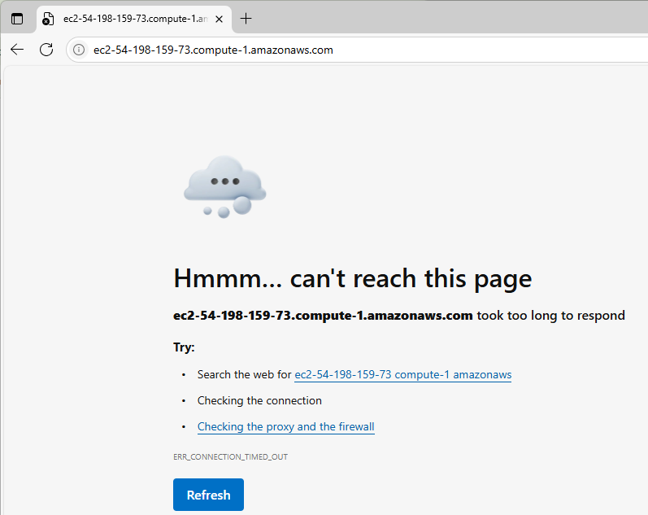

So, we are not able to see it.

But if you look here, we are able to go to the outside world from the instance. We are using here.

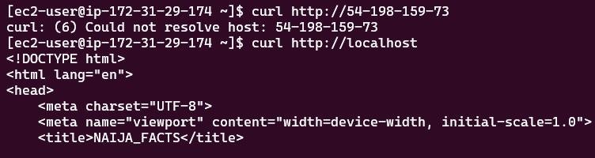

Note- curl is a command-line tool that fetches data from a URL.

As a result, the instance will be able to fetch data from external sources or communicate with other HTTP-based services on the internet. This adjustment ensures that while incoming connections to the instance may still be restricted, the instance itself can actively communicate over HTTP to external services.

Part - 2
Let's come to NACL.
1. First navigate to the search bar and search for VPC.

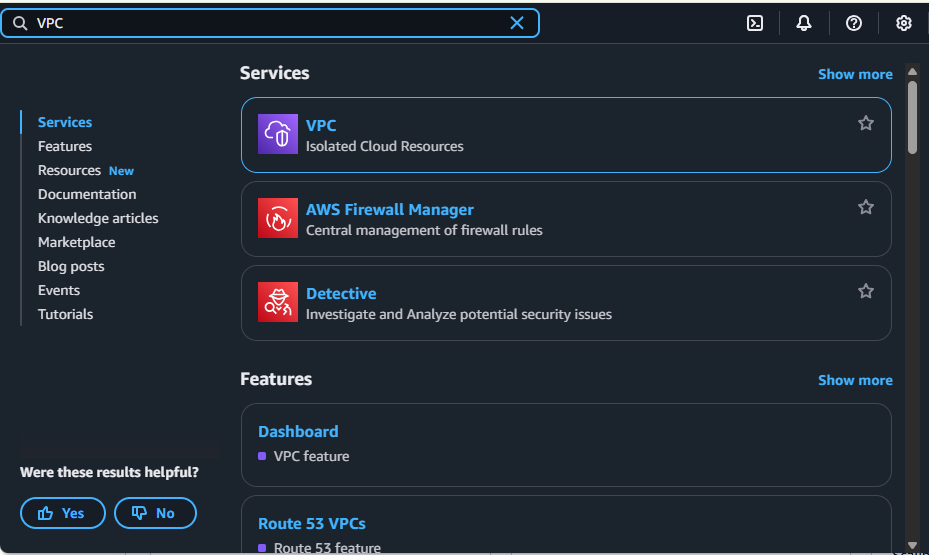

a) Then click on VPC.

2. Navigate to the Network ACLs in the left sidebar.

a) Click on "Create Network ACL."

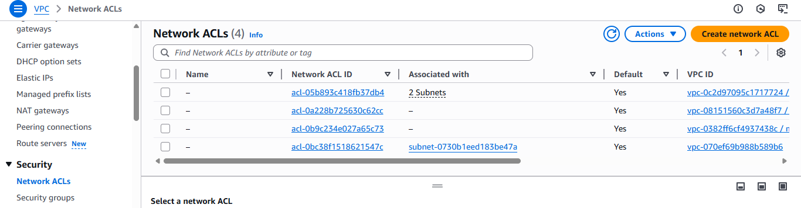

3. Now, provide a name for your Network ACL.

a) Choose the VPC you created in the [Previous session][../AWS VPC mini project.md] for the practical on VPC creation.

b) Then click on "Create network ACL".

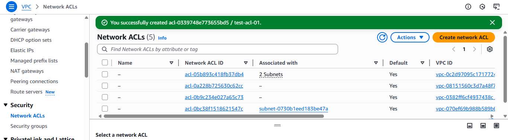

4. If you selected the Network ACL you created,

a) navigate to the "Inbound" tab.

By default, you'll notice that it's denying all traffic from all ports.

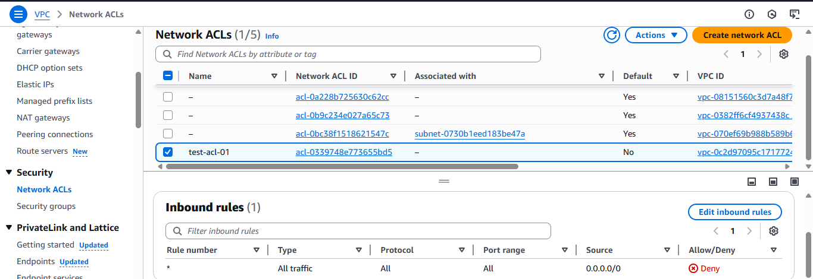

Similarly, if you look at the outbound rules, you'll observe that it's denying all outbound traffic on all ports by default.

b) Select the NACL.

c) And navigate to the "Outbound" tab.

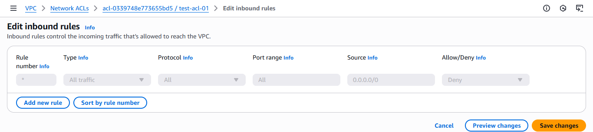

5. To make changes,

a) select the NACL,

b) Go to the "Inbound" tab.

c) And click on "Edit inbound rules".

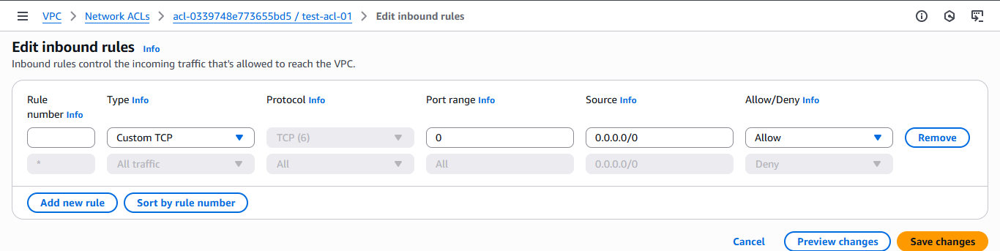

6. Now, click on "Add new rule."

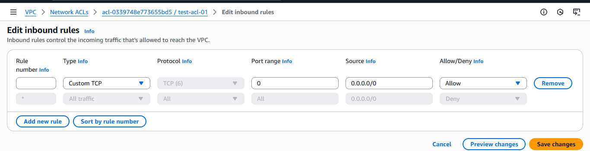

7. Now, choose the rule number.

a) Specify the type.

b) Select the source.

c) And determine whether to allow or deny the traffic.

d) Then click on "Save changes."

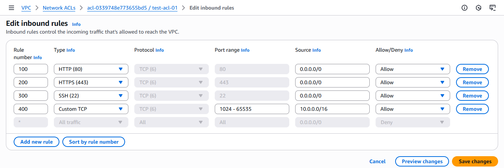

Currently, this NACL is not associated with any of the subnets in the VPC.

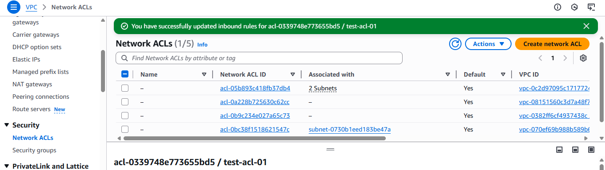

8. Let's associate it.

a) Select your NACL.

b) Click on "Actions."

c) Choose "Edit subnet association."

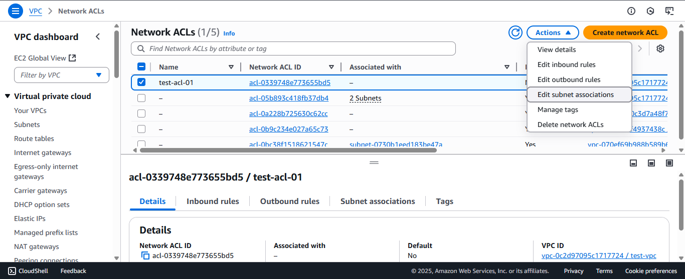

d) Then select your public subnet, as our instance resides in the public subnet.

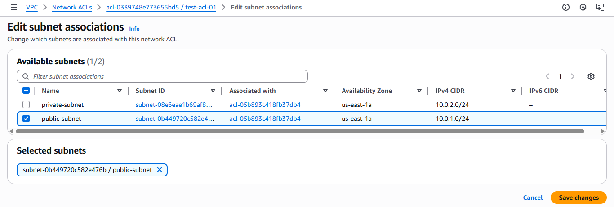

Once selected, you'll see it listed under "Selected subnets".
e) Finally, click on "Save changes".

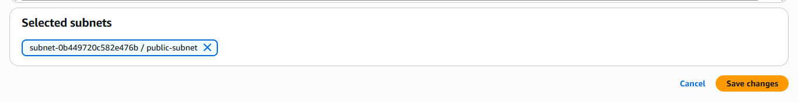

You have successfully associated your public subnet to this NACL.

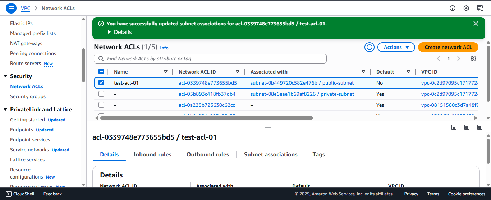

As soon as you have attached this NACL to your public subnet, and then you try to access the website again by typing the URL http://54-198-159-73/ you will notice that you are unable to see the website.

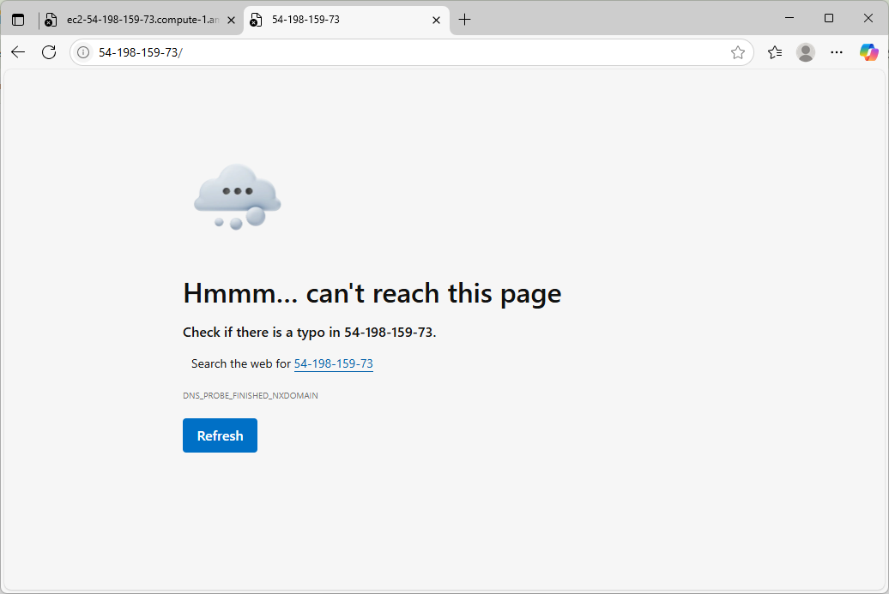

Although we've permitted all traffic in the inbound rule of our NACL, we're still unable to access the website. This raises the question: why isn't the website visible despite these permissions?

The reason why we're unable to access the website despite permitting inbound traffic in the NACL is because NACLs are stateless. They don't automatically allow return traffic. As a result, we must explicitly configure rules for both inbound and outbound traffic.

Even though the inbound rule allows all traffic into the subnet, the outbound rules are still denying all traffic.

You can see.

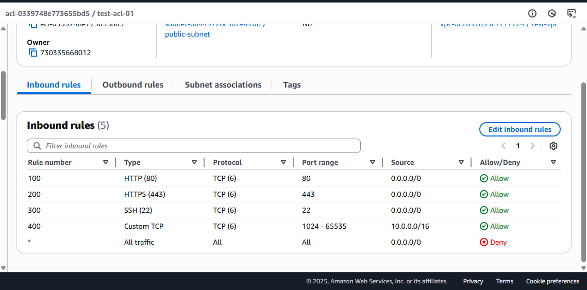

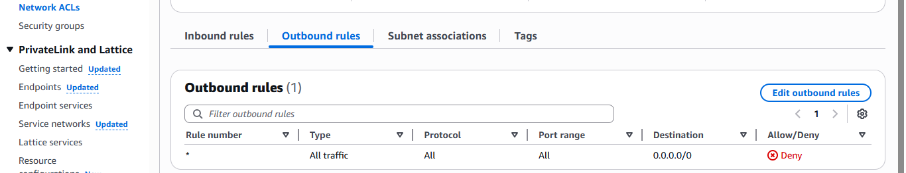

9. If we allow outbound traffic as well,

   a) Choose your NACL.

   b) Go to outbound tab.

   c) Click on "Edit outbound rules."

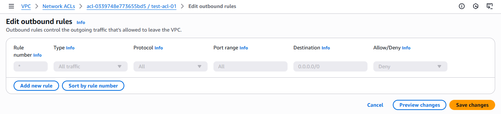

   d) Click on "Add rule."

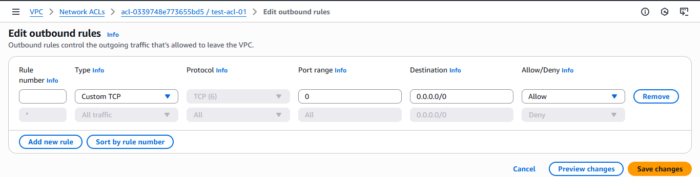

    e) Duplicate the process you followed fo creating the inbound rules to establish the outbound rule in a similar manner.

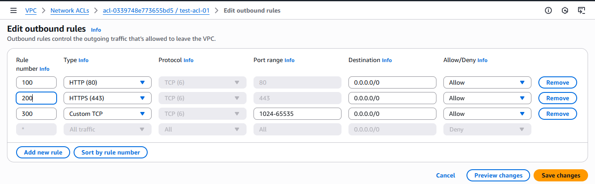

You have successfully created the rules

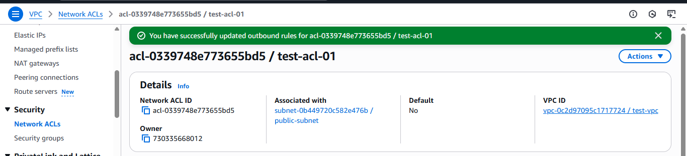

Upon revisiting the website, you should now be able to access it withou any issues.

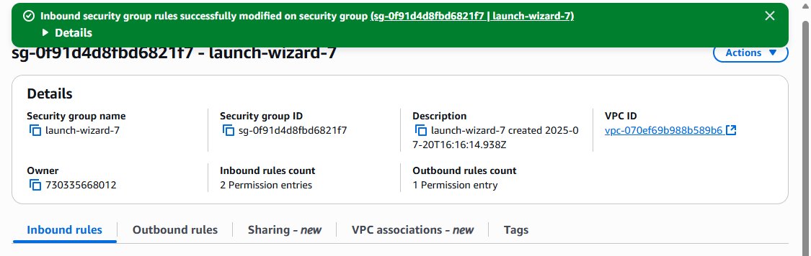

Now let's see more interesting scenario.

In this scenario:
Security Group: Allows inbound traffic for HTTP and SSH protocols and permits all outbound traffic.
Network ACL: Denies all inbound traffic. Let's observe the outcome of this configuration.

Security group,
Configuring it,

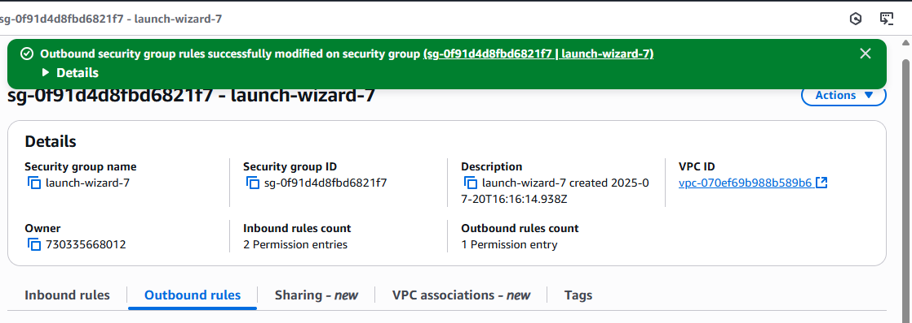

NACL,
Let's remove it so by default it be denied all traffic.

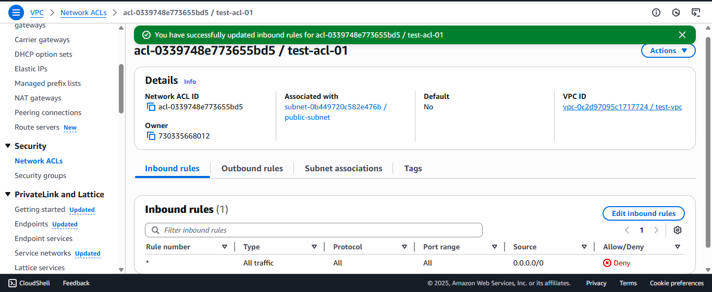

Additionally, the outbound rule will be removed, defaulting to deny all traffic by default.


Now let's try to access the website,


So we are unable to access the website, why? Even if we have allowed inbound traffic to HTTP in security group.

### Security Group and NACL Overview

#### The Problem: Website Inaccessibility Despite Inbound Security Group Rule
Even with an inbound HTTP rule allowing traffic in the Security Group, the website remains inaccessible. This is unexpected because Security Groups are stateful, meaning they should automatically allow return traffic for connections initiated by the instance.

#### Analogy: Building Security Layers
Imagine a building with two layers of security:
1.  **Entrance Security Guard (NACL):** This guard checks everyone entering and has a list of general rules (e.g., "no backpacks allowed"). If you don't meet these rules, you're denied entry to the building.
2.  **Room Security Guard (Security Group):** Once inside the building, each room has its own guard with specific rules (e.g., "only employees allowed"). These rules are specific to each room.

Traffic first passes through the NACL. If it's allowed, it then goes through the Security Group. If either security layer denies the traffic, it's blocked.

#### The Root Cause: NACL Denying Inbound Traffic
The reason the website is inaccessible is that the **Network Access Control List (NACL)** has denied inbound traffic. Even if the Security Group allows it, the NACL's denial overrides it, preventing traffic from reaching the Security Group. This is analogous to the entrance security guard denying entry to the building, preventing anyone from even reaching the room's security guard.

#### Scenarios and Outcomes of NACL and Security Group Interactions:

* **NACL allows all inbound/outbound, Security Group denies all inbound/outbound:**
    * **Outcome:** Website access will be blocked because the Security Group denies all traffic, overriding the NACL's allowance.
* **NACL denies all inbound/outbound, Security Group allows all inbound/outbound:**
    * **Outcome:** Website access will be blocked because the NACL denies all traffic, regardless of the Security Group's allowances.
* **NACL allows HTTP inbound, outbound traffic is denied; Security Group allows inbound traffic and denies outbound traffic:**
    * **Outcome:** Website access will be allowed for inbound HTTP traffic. However, if the website requires outbound traffic to function properly (e.g., to fetch external resources), it won't work due to the Security Group's denial of outbound traffic.
* **NACL allows all inbound/outbound, Security Group allows all inbound/outbound:**
    * **Outcome:** Website access will be allowed as both NACL and Security Group allow all traffic.
* **NACL denies all inbound/outbound, Security Group allows HTTP inbound and denies outbound traffic:**
    * **Outcome:** Website access will be blocked because the NACL denies all traffic, regardless of the Security Group's allowances.

### Project Reflection:
- Successfully configured Security Groups and NACLs to control inbound and outbound traffic in AWS.
- Identified the differences between Security Groups and NACLs and their respective roles in network security.
- Explored various scenarios to understand how Security Groups and NACLs interact and impact network traffic.
- Learned valuable troubleshooting techniques for diagnosing and resolving network connectivity issues in AWS.
- Overall, gained practical experience and confidence in managing network security within AWS environments.